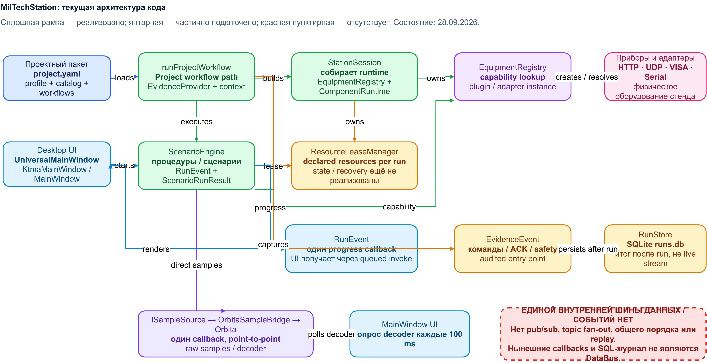
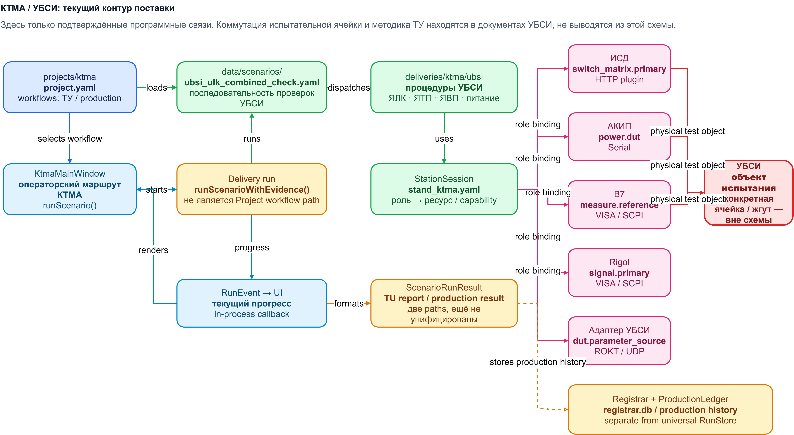

# Архитектура runtime и поставки КТМА / УБСИ

Этот документ фиксирует только фактические программные связи на 28.09.2026.
Он не является методикой испытаний УБСИ и не описывает физическую коммутацию
испытательной ячейки.

Редактируемая схема: [miltechstation-architecture-current.drawio](../../assets/miltechstation-architecture-current.drawio).



Второй лист этого же файла — контур КТМА / УБСИ. Его экспорт:



## Границы

```text
Репозиторий
  ├─ MilTechStation: station/, integrations/, apps/desktop/
  └─ КТМА: projects/ktma/, deliveries/ktma/, data/profiles/stand_ktma.yaml
       └─ УБСИ: deliveries/ktma/ubsi/, сценарий УБСИ и документы task/ubsi/
```

УБСИ — текущий объект работ. Выводы о его методике, ИСД или приборах не
переносятся автоматически в MilTechStation.

## Фактический runtime MilTechStation

| Контур | Реализация | Состояние |
|---|---|---|
| Project package | `ProjectDefinition`, `loadProjectPackage()` в `station/include/orbita_stand/project.h`, `station/src/project.cpp` | реализован |
| Scenario runtime | `ScenarioEngine` и `ICapabilityProvider` в `station/include/orbita_stand/scenario.h`, `station/src/scenario.cpp` | реализован |
| Сборка оборудования | `StationSession` создаёт `EquipmentRegistry` и `ComponentRuntime`: `station/include/orbita_stand/station_session.h`, `station/src/station_session.cpp` | реализован |
| Операторские окна | `apps/desktop/universal_mainwindow.cpp`, `apps/desktop/ktma_mainwindow.cpp`, `apps/desktop/mainwindow.cpp` | реализован, с несколькими маршрутами запуска |
| Lease | `ResourceLeaseManager` принадлежит `StationSession`; common run получает lease всех явно объявленных ресурсов до возврата из `safeStopAll()` | реализовано для сценариев с `requiredResources`; state/recovery ещё нет |
| Структурированное evidence | `EvidenceProvider` в `station/src/project.cpp` и `RunStore` в `station/src/run_store.cpp` | audited entry point и SQLite save/load реализованы; не каждый вызов `ScenarioEngine::run()` обязан его использовать; raw-artifact metadata ещё не связано с run |

`runScenarioWithEvidence()` оборачивает оборудование в `EvidenceProvider`,
затем запускает сценарий. `runProjectWorkflow()` использует тот же entry point.
Текущие Desktop-маршруты `MainWindow`, `UniversalMainWindow` и
`KtmaMainWindow` передают в него `StationSession::leases()`. Поэтому сценарий
с `requiredResources` получает полный межзапусковый lease до выхода
`ScenarioEngine::run()` после его безусловного `safeStopAll()`.

Сценарий без `requiredResources` не получает такую блокировку: runtime не
угадывает физические ресурсы по старому capability-only вызову. Поэтому
критерий состояния и recovery остаётся открытым.

`RunStore::load()` восстанавливает сохранённый `ScenarioRunResult`, включая
identity, шаги, measurements, progress events и structured evidence; HTML/CSV
renderer принимает эту же модель. Это проверяется `stand.run_store_context` на
generic run, выполненном через `runScenarioWithEvidence()`. `RunArtifacts`
пока не записывает свою directory/файлы в run metadata, поэтому это не
доказывает сохранение raw-artifacts как части evidence.

## Есть ли единая шина данных?

**Нет: общей внутренней шины данных или событий в текущем коде нет.** Это
проверено по следующим отдельным механизмам.

| Поток | Фактический путь | Почему это не DataBus |
|---|---|---|
| Сырые отсчёты | `ISampleSource::setSamplesCallback()` → `OrbitaSampleBridge` → `Orbita::pushSamples()` | у источника один заменяемый callback, нет подписок и fan-out |
| Прогресс сценария | `ProcedureContext::eventSink` → `ScenarioEngine` → один `progressSink` → Qt queued invoke в окне | это callback одного конкретного run, а не broker |
| Evidence | `EvidenceProvider` копит `EvidenceEvent`, `RunStore` записывает результат после run в SQLite | это посмертный журнал, а не live stream |
| Показания decoder в legacy UI | `MainWindow` опрашивает decoder по таймеру 100 ms | polling конкретного окна, не подписка на поток |

Кодовые источники: `station/include/orbita_stand/sample_source.h`,
`integrations/orbita/src/orbita_sample_bridge.cpp`,
`station/include/orbita_stand/scenario.h`, `station/src/scenario.cpp`,
`station/src/project.cpp`, `station/src/run_store.cpp`,
`apps/desktop/universal_mainwindow.cpp`, `apps/desktop/ktma_mainwindow.cpp` и
`apps/desktop/mainwindow.cpp`.

HTTP, UDP, VISA/SCPI и serial — транспорты общения с оборудованием. Они не
являются внутренней шиной данных станции.

Следствие для V1: нельзя называть существующие callbacks «шиной». Для будущей
единой шины потребуются отдельный контракт сообщения, подписки/fan-out,
очерёдность, потоковая безопасность, политика переполнения и решение о
постоянном журналировании. Это отдельный незакрытый пункт спеки, а не
функция, которая уже есть.

## Контур КТМА / УБСИ

Поставочный проект расположен в `projects/ktma/project.yaml`. Его profile
`data/profiles/stand_ktma.yaml` задаёт роли ресурсов. Для текущего УБСИ в
коде профиля/поставки задействованы роли:

| Роль | Транспорт/компонент, как задано в поставке |
|---|---|
| `power.dut` | АКИП, serial |
| `switch_matrix.primary` | ИСД, HTTP plugin |
| `measure.reference` | В7, VISA/SCPI |
| `signal.primary` | Rigol, VISA/SCPI |
| `dut.parameter_source` | адаптер УБСИ, ROKT/UDP |

Процедуры УБСИ находятся в `deliveries/ktma/ubsi/`; последовательность
задаёт `data/scenarios/ubsi_ulk_combined_check.yaml`. Фактическая
коммутация ячейки и нормативная интерпретация принадлежат документам
[`task/ubsi/`](../../task/ubsi/), а не этой архитектурной карте.

В delivery route существуют раздельные результаты/хранилища: `ScenarioRunResult`
и путь ТУ-отчёта, а также `Registrar` / `ProductionLedger` с production
history. Они пока не являются единым универсальным `RunStore`-маршрутом.

## Проверка карты

Карту кода и lease-срез проверили профильные автоматические тесты 28.09.2026:

```text
stand.project_definition
stand.run_store_context
integration.orbita_sample_bridge
desktop.test_page_smoke
```

Они подтверждают загрузку project package, сохранение run/evidence, bridge
отсчётов и базовую UI-проверку. `stand.scenario_resource` дополнительно
проверяет конфликт lease, отсутствие оборудования при конфликте и release
после run. Они не доказывают наличие общей шины данных — такой шины нет в
перечисленных реализациях.
